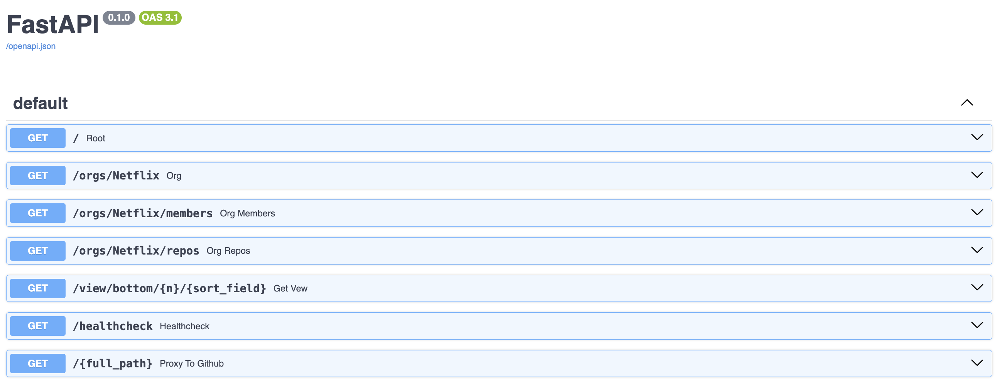

### Purpose

I created this project to demonstrate how to setup a FastAPI application to act
as a caching server for the GitHub related queries. I took a containerized approach
to solving this problem by spinning up one (or more) FastAPI containers and one redis
container.

### Environment Variables

The GitHub REST API is rate limited heavily if you don't provide a `GITHUB_API_TOKEN`. In order to ensure that we don't hit the most conservative rate limit, we should pass this API token. This can be done by setting the variable with the command above.

Additionally, you can also set the `APP_PORT` environment variable to access the application.

```zsh
GITHUB_API_TOKEN=YOUR_TOKEN_HERE APP_PORT=8000  docker-compose up --build
```

### Getting Started

To run this application, the recommended approach is to run it through Docker. The root
of this project contains a [docker-compose.yml](docker-compose.yml) file that spins up
the necessary containers.

To set the port you would like to access the application on, you can edit the docker-compose configuration file to map to a different port. Currently
it is being defaulted to port `8000` if it does not pick up the `APP_PORT` environment variable on startup. You can also hard code the port value into
the docker-compose file if you prefer to avoid setting an environment variable.

```yaml
server:
  container_name: server
  build:
    context: ./server
    dockerfile: Dockerfile
  ports:
    - "${APP_PORT:-8000}:8000"
  environment:
    - GITHUB_API_TOKEN=${GITHUB_API_TOKEN}
```

To run the application, you can simply run the command below from the root directory

```zsh
GITHUB_API_TOKEN=YOUR_TOKEN_HERE APP_PORT=8000  docker-compose up --build
```

Once the containers are running, we can use the docs page for the FastAPI server to see all
of our endpoints that have been defined. You can reach this page through your broswer by
going to [http://localhost:8000/docs](http://localhost:8000/docs) if you have not changed the default port. The page should look like the below screenshot.



### Running Tests

Tests are provided for this project to test the functionality of our endpoints. This test
suite is defined in the [api-suite.sh](api-suite.sh) file.

The tests in the suite may have drifted a bit over time so the results for the created views
tests may fail since those metrics have changed over time. You can still validate that everything
is working by looking at the expected vs response output in the console and see that the response
values for this application follow the same pattern.

### Development Mode

If you would like to develop additional features, run the `docker-compose.dev.yml` file instead.
This will spin up a FastAPI container in development mode with volumes mounted into the container
to allow for hot reloading!

```zsh
docker-compose -f docker-compose.dev.yml up --build
```

### Interacting with Redis

I have added two endpoints that can be helpful for interacting with the redis cache as well.
There is a `/clear-cache` endpoint that can be used to clear out the contents of the cache.
Any subsequent requests after this is called will result in refreshing the cache. There is also
a `/cached-keys` endpoint that returns all of the keys we have in our redis layer. If all keys are cached
correctly, the response will look like the below. To the right of the keys, you can find the endpoint
from GitHub that is being cached.

```jsonc
[
  "ORG_MEMBERS", # orgs/Netflix/members
  "ORG_REPOS",   # orgs/Netflix/repos
  "ORGS",        # orgs/Netflix
  "BASE",        # /
]
```
